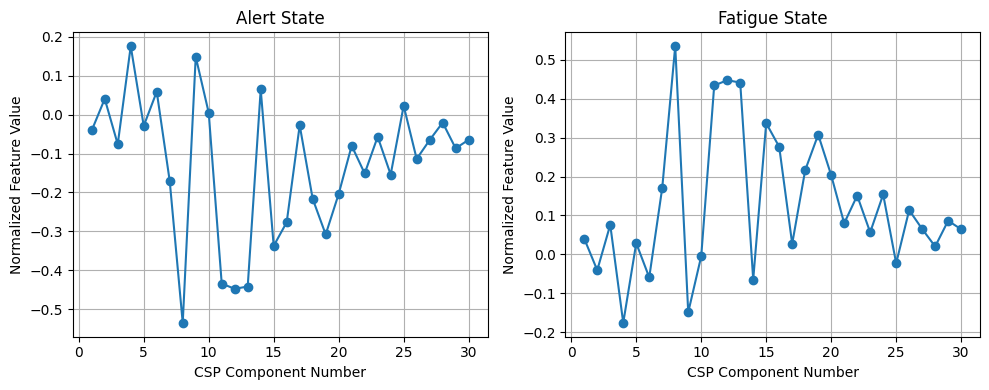
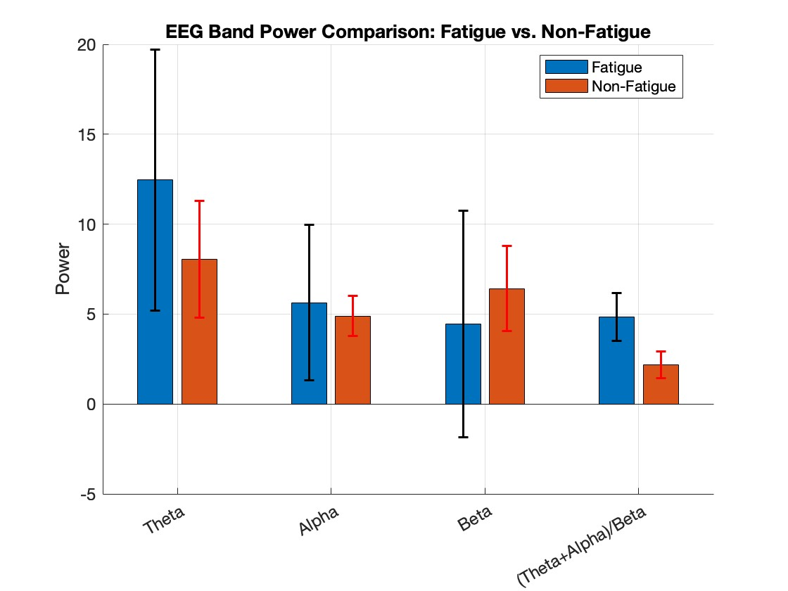

# CSP & PSD EEG Fatigue Detection

Pipeline to compare spatial (CSP) and spectral (PSD) feature extraction methods for driver fatigue detection on EEG data. The repository accompanies the paper “A Comparative Study of Classical Spectral and Spatial Feature Extraction Methods for Fatigue Detection via EEG Signals”.

## Setup
- Python 3.9+ recommended.
- Create/activate a virtual environment (example: `python -m venv myvenv && source myvenv/bin/activate`).
- Install dependencies: `pip install -r requirements.txt`.

## Data
- Download the dataset from Figshare: https://figshare.com/articles/dataset/EEG_driver_drowsiness_dataset/14273687?file=30707285
- Place the file at `data/dataset.mat`.
- PSD features are generated automatically to `data/EEG_PSD_Features.mat` on first run.

## Configuration
Edit `Classes/config.py`:
- `mode`: set to `selected` (default) to use the pre-selected CSP/PSD features, or `all` to run with all features.
- Other hyperparameters (e.g., `num_components`, `n_features_options`) can be tuned as needed.

## Running
- Full pipeline (runs CSP then PSD, saves metrics and plots):
  ```
  python src/run_code.py
  ```
- EDA only (runs exploratory plots and exits):
  - CSP EDA: `python src/run_code.py --configuration Analysis_CSP`
  - PSD EDA: `python src/run_code.py --configuration Analysis_PSD`

### Outputs
- Metrics: `csp_{mode}_metrics.json`, `psd_{mode}_metrics.json` in the repo root.
- PSD features: `data/EEG_PSD_Features.mat`.
- Figures (feature importances, selection curves, accuracy comparison) written to `src/`.

### Key Plots
- CSP normalized features (alert vs fatigue):  
  
- PSD band power comparison (fatigue vs non-fatigue):  
  

## Repository Structure
- `src/run_code.py`: entry point; runs EDA when `--configuration` is set, otherwise executes CSP then PSD and writes metrics/plots.
- `Classes/config.py`: global configuration for data paths, feature mode (`all` or `selected`), and model hyperparameters.
- `src/csp_analysis.py`, `src/psd_analysis.py`, `src/evaluation.py`: core analysis routines for CSP/PSD feature extraction and model evaluation.
- `eda/`: exploratory scripts (`csp.py`, `psd.py`) invoked via `--configuration Analysis_CSP` or `--configuration Analysis_PSD`.
- `data/`: place `dataset.mat` here; generated PSD features saved as `EEG_PSD_Features.mat`.
- `comparison/analysis.py`: auxiliary comparison script.
- `Classes/`: helper classes (currently config).
- `src/figures/figure_plotting.py`: plotting utilities for accuracy comparison.

## Citation (paper)
If you use this code, please cite:
```
@INPROCEEDINGS{11101841,
  author={Zahid, Arslan Mohammad and Subaşı, Yavuz Giray and Jafarifarmand, Aysa},
  booktitle={2025 9th International Symposium on Innovative Approaches in Smart Technologies (ISAS)},
  title={A Comparative Study of Classical Spectral and Spatial Feature Extraction Methods for Fatigue Detection via EEG Signals},
  year={2025},
  pages={1-8},
  doi={10.1109/ISAS66241.2025.11101841}
}
```

## Citation (dataset)
If you use the dataset, please credit both the creators of the preprocessed set and the original collectors:
```
@article{cui2022compact,
  title={A compact and interpretable convolutional neural network for cross-subject driver drowsiness detection from single-channel EEG},
  author={Cui, Jian and Lan, Zirui and Liu, Yisi and Li, Ruilin and Li, Fan and Sourina, Olga and M{\"u}ller-Wittig, Wolfgang},
  journal={Methods},
  volume={202},
  pages={173--184},
  year={2022},
  publisher={Elsevier}
}

@article{cao2019multi,
  title={Multi-channel EEG recordings during a sustained-attention driving task},
  author={Cao, Zehong and Chuang, Chun-Hsiang and King, Jung-Kai and Lin, Chin-Teng},
  journal={Scientific data},
  volume={6},
  number={1},
  pages={19},
  year={2019},
  publisher={Nature Publishing Group UK London}
}
```
